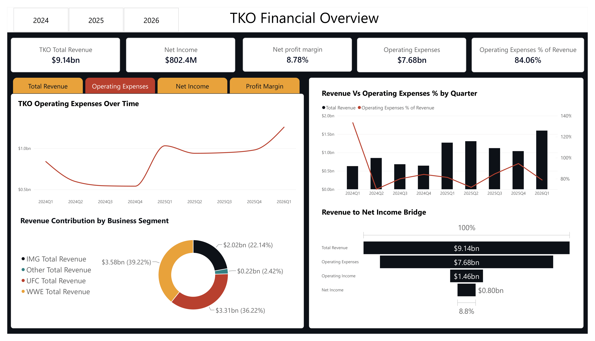
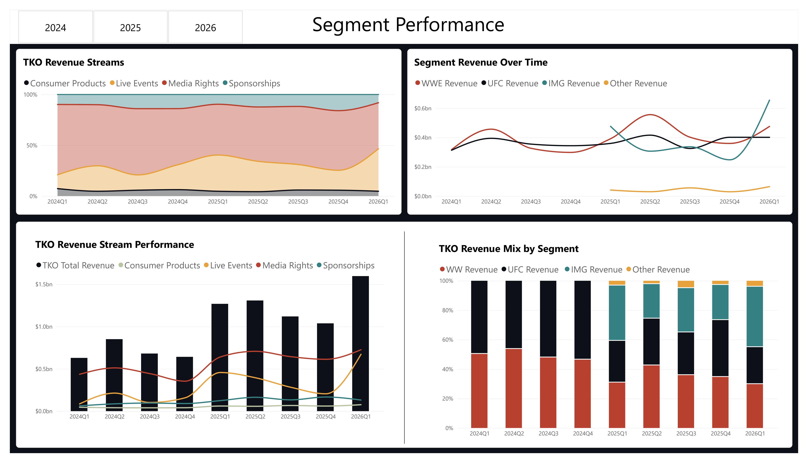
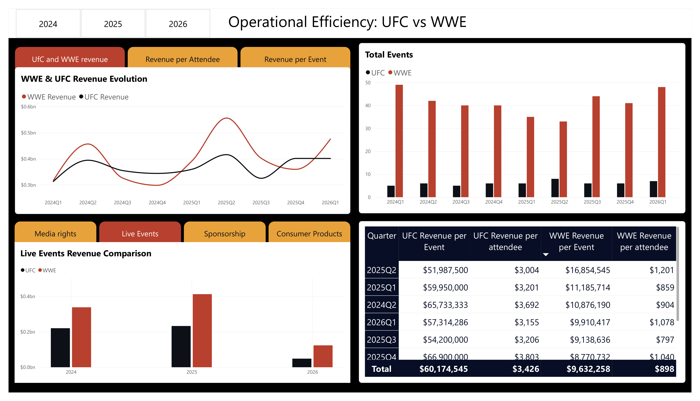

# TKO Financial Performance Analysis

## About the project

This project looks at TKO Group Holdings' financial performance from **Q1 2024 to Q1 2026**, focusing on revenue, profitability, revenue composition and the performance of UFC and WWE.

The analysis was done using **SQL and Power BI**.

The main goal was to understand where TKO's revenue comes from, how its financial performance changed over time, and how UFC and WWE compare when looking at event activity and revenue generation.

---

## Dataset

The project uses three datasets:

* `TKOPerformance.csv`
* `UFCPerformance.csv`
* `WWEPerformance.csv`

The data is reported by quarter and covers **Q1 2024 – Q1 2026**.

The datasets contain information about:

* Total revenue
* Revenue by segment
* Media rights
* Live events
* Sponsorship
* Consumer products
* Operating expenses
* Operating income
* Net income
* Ticketed events
* Attendance
* Estimated tickets distributed

There are some limitations in the data. IMG and Other revenue are only available from Q1 2025 onwards. WWE ticket distribution is estimated, while UFC uses announced attendance, so the audience-related comparisons between the two should be treated as directional.

---

## Questions

The analysis was built around the following questions:

1. How has TKO's revenue changed over time?
2. Which segments contribute the most revenue?
3. Which segments have grown the most?
4. Which revenue streams contribute the most to TKO's revenue?
5. How has profitability changed over time?
6. How significant are operating expenses compared with revenue?
7. Which quarters combine high revenue with strong profitability?
8. How are UFC and WWE performing quarter over quarter?
9. How much revenue does UFC and WWE generate per event?
10. How efficiently do UFC and WWE turn event activity and audience/ticket distribution into revenue?

---

## SQL

SQL was used to answer the business questions and calculate the main metrics.

Some of the techniques used:

* `LAG()`
* `SUM()`
* Window functions
* `RANK()`
* CTEs
* Aggregations
* Revenue growth calculations
* Profit margins
* Revenue contribution
* Revenue per event
* Revenue per attendee/ticket

The queries are stored in the `sql` folder.

---

## Power BI

The Power BI report is divided into three pages.

### Financial Overview

Looks at TKO's overall financial performance, including:

* Revenue evolution
* Net income
* Net profit margin
* Operating expenses
* Revenue vs profitability

### Segment & Revenue Stream Performance

Focuses on where TKO's revenue comes from.

It compares:

* UFC
* WWE
* IMG
* Other

It also looks at the contribution of:

* Media Rights
* Live Events
* Sponsorship
* Consumer Products

### UFC vs WWE — Operational Efficiency

The last page compares UFC and WWE based on:

* Revenue per event
* Revenue per attendee/ticket
* Number of events
* Revenue evolution

---

## Key findings

### Revenue and profitability

TKO generated approximately **$9.14B in revenue** during the period covered by the dataset, with **$802.4M in net income**.

Revenue was quite volatile from quarter to quarter. It went from around **$630M in Q1 2024** to more than **$850M in Q2**, dropped during the second half of 2024, then increased significantly in 2025 and reached approximately **$1.60B in Q1 2026**.

The worst quarter was **Q1 2024**, when TKO had negative operating income and net income. Net profit margin was approximately **-39.6%**.

The strongest quarter for profitability was **Q2 2025**, with a net profit margin of approximately **20.9%**.

The overall net profit margin across the dataset was **8.78%**.

---

### Revenue composition

**WWE was the largest contributor over the period, generating around $3.58B in revenue.**

However, the composition changed during the period.

In 2024, most of the reported segment revenue came from UFC and WWE because IMG and Other were not yet reported in the dataset.

From 2025 onwards, IMG became an increasingly important part of the revenue mix. By Q1 2026, IMG represented a much larger share of reported segment revenue than it had at the beginning of the dataset.

Among the revenue streams, **Media Rights was consistently the largest contributor**, while Consumer Products represented the smallest share.

---

### UFC vs WWE

One of the more interesting differences between UFC and WWE is the amount of revenue generated per event.

On average:

* **UFC: ~ $60M revenue per event**
* **WWE: ~ $10M revenue per event**

However, WWE runs many more events.

For example, in Q1 2024:

* UFC: **5 events**
* WWE: **49 events**

This means that UFC generates considerably more revenue per event, while WWE generates higher total revenue through a much larger event volume.

The revenue-per-attendee/ticket comparison also favored UFC, although the two datasets use different audience measures.

---

### Operating expenses

Operating expenses totaled approximately **$7.68B**, representing around **84% of total revenue** across the period.

Q1 2024 was particularly unusual, with operating expenses exceeding revenue and contributing to the negative operating result.

After that quarter, operating expenses remained below revenue but still represented a significant part of TKO's revenue.

---

## Main takeaway

The main difference between UFC and WWE is not simply which one generates more revenue.

**UFC generates much more revenue per event, while WWE relies on a much higher event volume to generate its overall revenue.**

At the TKO level, revenue also became more diversified during the period, particularly as IMG became a significant contributor from 2025 onwards.

